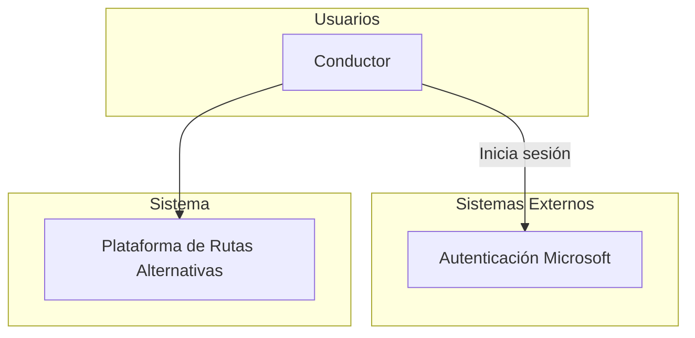
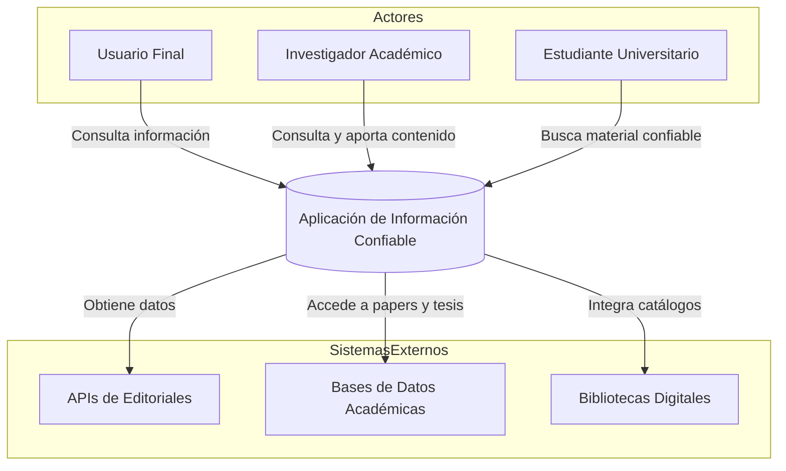

# Especificaciones de requisitos de Software 

**proyecto: aplicación informativa para estudiantes**

## Ficha del documento

| Fecha | Versión | Autor | Verificado | Observaciones |
|:-----:|---------|-------|------------|---------------|
|       |         |       |            |               |

## Contenido

## 1. Introducción 

TODO: Redactar un parrafo donde se de una situación al contenido de este documento 

### 1.1 Proposito 

En este documento se define las especificaciones funcionales y no funcionales de gamificación sobre el uso de rutas alternativas para la ciudad de Bogotá. Este sera utilizado como guia para clientes y desarrolladores. 

### 1.2 Alcance 

### 1.3 Personal involucrado

|         Nombre         | Paula Garcia                                                                          |
|:----------------------:|---------------------------------------------------------------------------------------|
| Rol                    | Estudiante                                                                            |
| Categoria profecional  | Ingenieria de sistemas                                                                |
| Responsabilidad        | Diseñar, desarrollar e implementar el backend del sistema, incluida la base de datos. |
| Información            | pauladgarcia@ucompensar.edu.co                                                        |

### 1.4 Definiciones, acronimos y abreviaturas 

| Nombre  | Descripción                                          |
|---------|------------------------------------------------------|
| Usuario | Persona que usará el sistema para gestionar procesos |
| ERS     | Especificación de Requisitos Software                |
| RF      | Requerimiento Funcional                              |
| RNF     | Requerimiento No Funcional                           |

### 1.5 Referencias 

### 1.6 Resumen 

## 2. Descripción 

### 2.1 Perspectiva del producto 

#### Diagrama de contexto 

